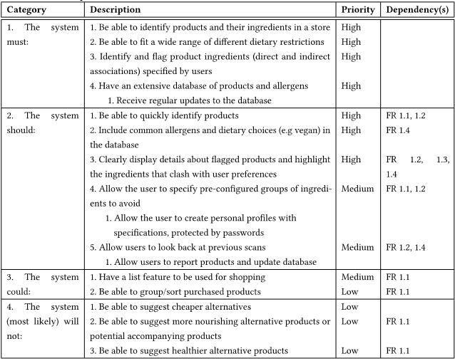
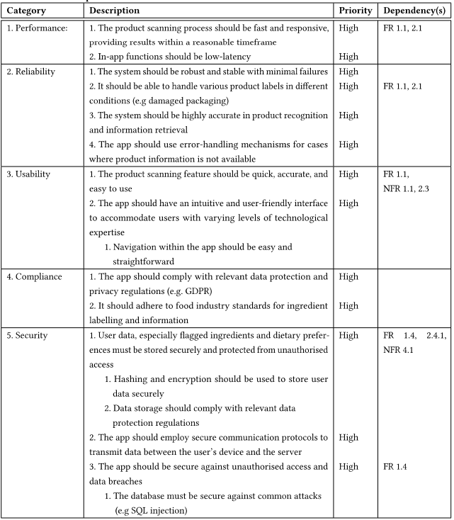
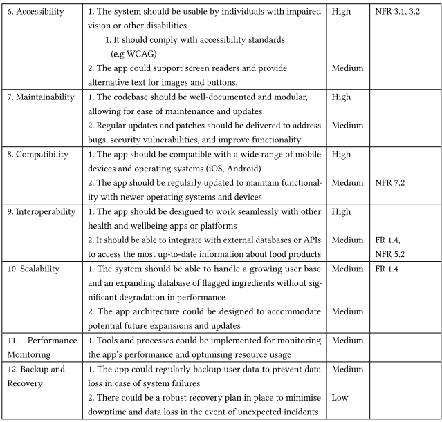

# Experimental-Systems-Project

## Documentation

### Expo

- [Simple Expo app tutorial](https://docs.expo.dev/tutorial/introduction) <b>(recommended)</b>
- [Expo SDK tools](https://docs.expo.dev/versions/latest)
- [Expo documentation](https://docs.expo.dev)

### React Native

- [React Native Components](https://reactnative.dev/docs/components-and-apis)</li>
- [React Navigation Library](https://reactnavigation.org/docs/getting-started)

### Firebase

- [Firestore quickstart](https://firebase.google.com/docs/firestore/quickstart)
- [Authentication (email and password)](https://firebase.google.com/docs/auth/web/start)

### API

- [Open Food Facts API](https://openfoodfacts.github.io/openfoodfacts-server/api/tutorial-off-api/)

## Youtube videos

- [React Native Authentication with Firebase and Expo in 27 minutes](https://youtu.be/ql4J6SpLXZA)

## UML Class Diagram

## Functional Requirements

## Non-Functional Requirements

